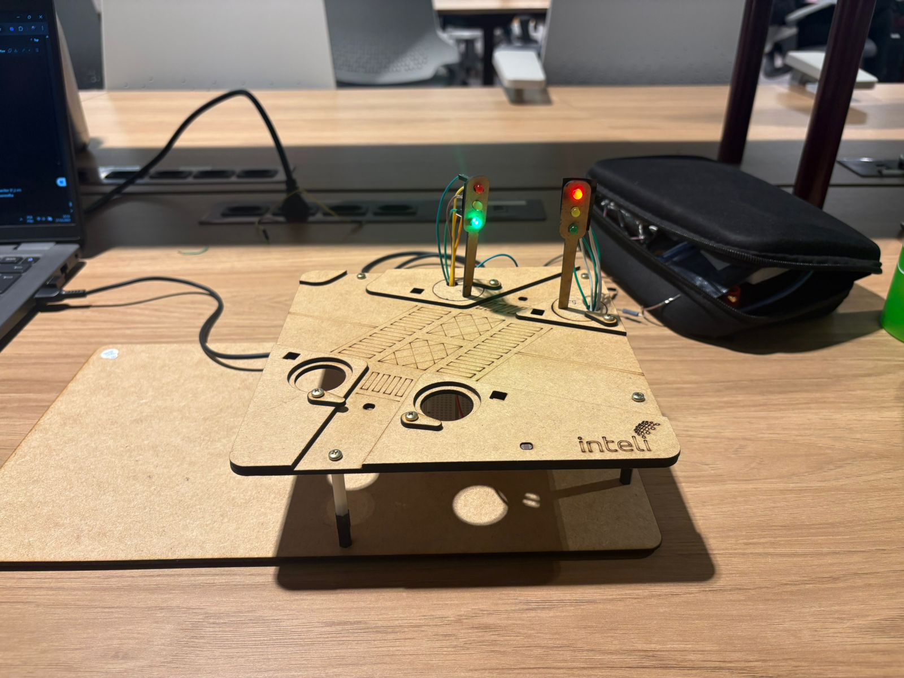
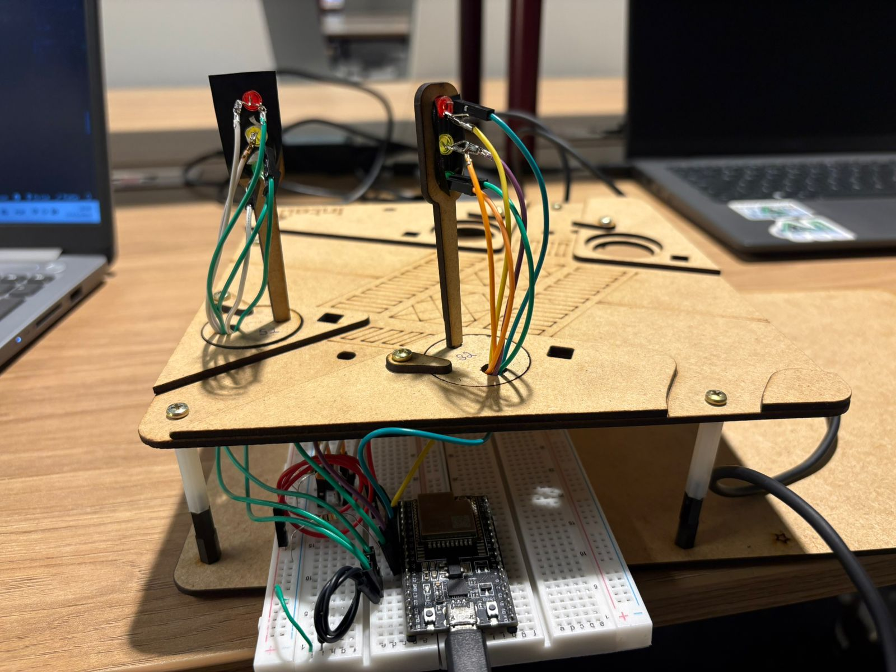
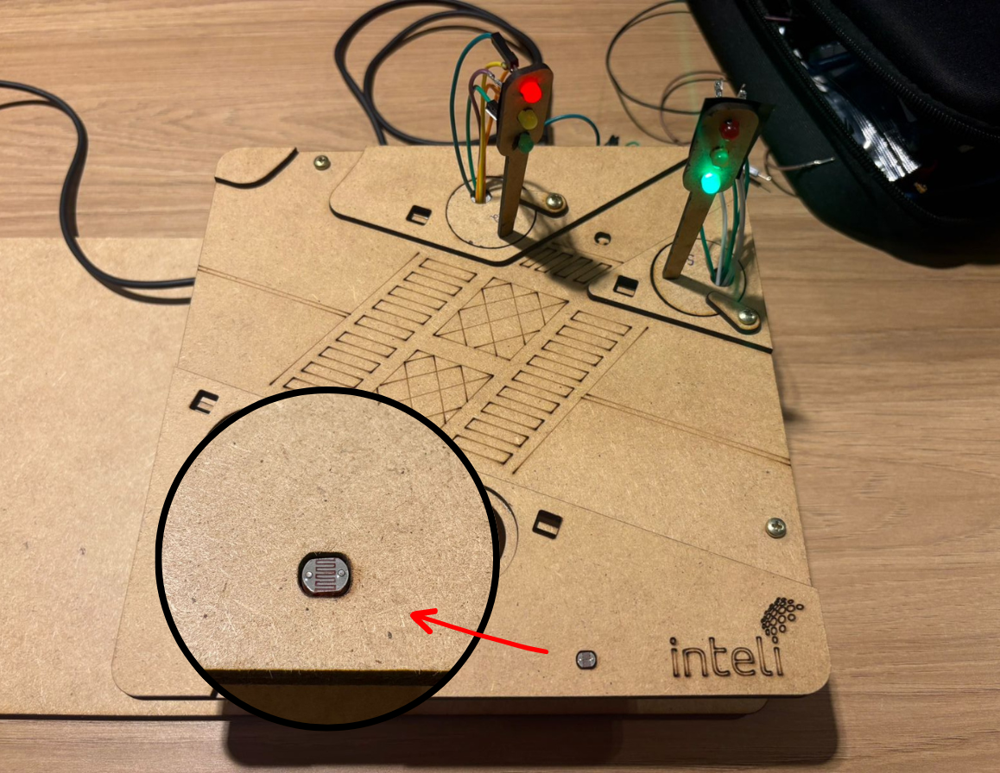
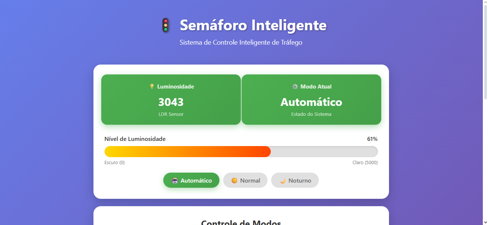
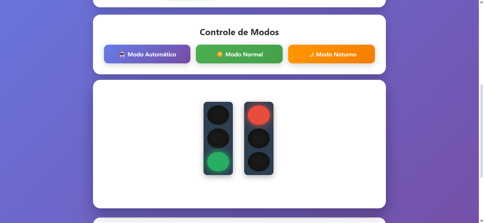

# Semáforo Inteligente - Grupo 1

Este projeto implementa dois semáforos inteligentes controlados por um **ESP32**, utilizando um **sensor LDR** para detectar luminosidade ambiente e adaptar automaticamente o comportamento dos sinais, incluindo um **modo noturno** e detecção de veículos.  

<div align="center">
<sub>Figura 1 - Circuito Completo </sub>
<br>

<br>
<sup>Fonte: Material produzido pelos autores, 2025.</sup>
</div>

## Integrantes

- Miguel Ferreira de Siqueira Almeida
- Lucas Picinato Rogero
- Bruno Frossard Silva
- Enzo Araujo de Rezendo
- Filipe Sudbrack Nunes
- Carlos Icaro Kauã Coelho Paiva

## Materiais Utilizados
| Componente | Quantidade |
|------------|------------|
| ESP32 | 1 |
| Protoboard | 1 |
| LED Vermelho | 2 |
| LED Amarelo | 2 |
| LED Verde | 2 |
| LDR | 1 |
| Resistores 220Ω | 7 |
| Jumpers | 10 |
| Cabo USB | 1 |


## Montagem do Circuito

### Pinos dos Semáforos
<div align="center">
<sub>Figura 2 - Ligações LEDs </sub>
<br>

<br>
<sup>Fonte: Material produzido pelos autores, 2025.</sup>
</div>

#### Semáforo 1:
| LED | GPIO |
|-----|------|
| Verde | 12 |
| Amarelo | 14 |
| Vermelho | 27 |

#### Semáforo 2:
| LED | GPIO |
|-----|------|
| Verde | 26 |
| Amarelo | 25 |
| Vermelho | 33 |

## Funcionamento do Sistema

### Modo Normal

Os semáforos funcionam com um ciclo padrão:

Semáforo 1  
- Verde: 3 segundos  
- Amarelo: 1.5 segundos  
- Vermelho: 6 segundos  

Semáforo 2  
- Vermelho enquanto o semáforo 1 está verde  
- Verde enquanto o semáforo 1 está vermelho 


### Modo Noturno

Ativado automaticamente quando o valor do LDR é baixo (indicando ambiente escuro).

Comportamento:
- LEDs amarelos piscando em ambos os semáforos

O modo noturno também pode ser ativado manualmente pela interface web.


### Funcionamento do LDR
<div align="center">
<sub>Figura 3 - Sensor LDR </sub>
<br>

<br>
<sup>Fonte: Material produzido pelos autores, 2025.</sup>
</div>

O **LDR** é um sensor resistivo cuja resistência varia de acordo com a quantidade de luz incidente. Em ambientes claros, sua resistência diminui; em ambientes escuros, aumenta. No projeto, ele é utilizado para:

1. Detectar condições de iluminação do ambiente (dia/noite)  
2. Identificar variações rápidas de luminosidade que simulam a passagem de um veículo  

O **LDR** foi conectado como um **divisor de tensão**, o que permite ao ESP32 ler valores analógicos entre **0** e **4095**.

#### Montagem Eletrônica

**5V ---- LDR ---- GPIO 32 ---- Resistor 10k ---- GND**

#### Leitura do LDR

O ESP32 converte a tensão em um valor entre:

- 0 (escuro total)
- 4095 (muita luz)

#### Intrepretação dos Valores:

| Condição | Valor do LDR |
| -------- | ------------ |
| Ambiente Claro | Acima de 2000 |
| Ambiente Moderado | 1200 a 2000 |
| Ambiente escuro / noite | Abaixo de 1200 |

Ativação Automática Modo Noturno


### Interface Web

A interface permite:

- Visualizar o valor do sensor LDR
- Visualizar a intensidade da luminosidade  
- Ativar os modo noturno / modo normal / modo automático
- Visualizar o modo atual
- Visualizar o funcionamento do semáforo online
- Visualizar os Endpoints do broker


<div align="center">
<sub>Figura 4 - Interface 1</sub>
<br>

<br>
<sup>Fonte: Material produzido pelos autores, 2025.</sup>
</div>
<div align="center">
<sub>Figura 5 - Interface 2</sub>
<br>

<br>
<sup>Fonte: Material produzido pelos autores, 2025.</sup>
</div>


## Código
[Código completo](codigo.ino)

### 1. Arquitetura Orientada a Objetos (POO)

O projeto utiliza a Programação Orientada a Objetos para encapsular a lógica e o estado dos componentes principais, resultando em um código mais modular, legível e de fácil manutenção. Duas classes principais foram definidas: `Semaforo` e `SemaforoInteligente`.

### 1.1. Classe `Semaforo`

A classe `Semaforo` representa um único conjunto de luzes (vermelho, amarelo, verde). Ela abstrai a complexidade de controlar os pinos digitais do ESP32, oferecendo uma interface simples para definir o estado do semáforo.

| Método | Descrição |
| :--- | :--- |
| `Semaforo(int redPin, int yellowPin, int greenPin)` | Construtor que recebe os pinos GPIO de cada cor. |
| `begin()` | Configura os pinos como `OUTPUT` e apaga todas as luzes. |
| `verde()`, `amarelo()`, `vermelho()` | Define o estado do semáforo para a cor correspondente. |
| `amareloPisca(bool ligado)` | Controla o estado da luz amarela para o modo noturno. |

**Exemplo de uso e encapsulamento:**

```cpp
class Semaforo {
private:
  int pRed;
  int pYellow;
  int pGreen;

  void setEstado(uint8_t redState, uint8_t yellowState, uint8_t greenState) const {
    digitalWrite(pRed, redState);
    digitalWrite(pYellow, yellowState);
    digitalWrite(pGreen, greenState);
  }

public:
  Semaforo(int redPin, int yellowPin, int greenPin)
      : pRed(redPin), pYellow(yellowPin), pGreen(greenPin) {}
  
  void verde() const { setEstado(LOW, LOW, HIGH); }
  // ... outros métodos de estado
};
```

### 1.2. Classe `SemaforoInteligente`

A classe `SemaforoInteligente` é o **controlador central** do sistema. Ela gerencia a lógica de transição de estados, a leitura do sensor de luminosidade (LDR) e a aplicação de modos de operação (Normal, Automático, Noturno).

Ela utiliza a composição, contendo referências a duas instâncias da classe `Semaforo` (`semaforo1` e `semaforo2`), e implementa a lógica de **histerese** para a transição automática para o modo noturno com base na luminosidade.

**Estrutura da Classe Controladora:**

```cpp
class SemaforoInteligente {
public:
  SemaforoInteligente(Semaforo& s1Ref, Semaforo& s2Ref, int ldrPin)
      : semaforo1(s1Ref), semaforo2(s2Ref), ldrPin(ldrPin) {}

  void atualizar(); // Método principal chamado no loop()
  void setModoAuto();
  void setModoNormal();
  void setModoNoturno();
  // ... outros métodos e membros privados
private:
  Semaforo& semaforo1;
  Semaforo& semaforo2;
  // ... lógica de estado e histerese
};
```

## 2. Comunicação MQTT e Interação com o Broker

A comunicação assíncrona e o controle remoto do semáforo são realizados através do protocolo **MQTT (Message Queuing Telemetry Transport)**, utilizando a biblioteca `PubSubClient`.

### 2.1. Configuração e Conexão

O cliente MQTT (`mqttClient`) é configurado para se conectar a um **Broker MQTT** (servidor) cujo endereço IP é definido pela constante `mqtt_server`.

```cpp
// Configurações do Broker
const char* mqtt_server = "169.254.14.138"; // IP do PC com Mosquitto (AJUSTE AQUI!)
const int mqtt_port = 1883;
const char* mqtt_client_id = "semaforo_inteligente";

// Inicialização
WiFiClient espClient;
PubSubClient mqttClient(espClient);

void setup() {
  // ...
  mqttClient.setServer(mqtt_server, mqtt_port);
  mqttClient.setCallback(callbackMQTT);
  // ...
}
```

A função `reconectarMQTT()` garante que a conexão com o broker seja restabelecida em caso de falha.

### 2.2. Tópicos de Comunicação

O sistema utiliza dois tópicos principais para a troca de informações:

| Tópico | Tipo de Comunicação | Descrição |
| :--- | :--- | :--- |
| `semaforo/telemetria` | **Publicação** (ESP32 -> Broker) | Envio periódico do estado atual do semáforo (luminosidade, modo ativo). |
| `semaforo/comandos` | **Inscrição** (Broker -> ESP32) | Recebimento de comandos para alterar o modo de operação (ex: "auto", "normal", "noturno"). |

### 2.3. Publicação de Telemetria

A função `publicarTelemetriaMQTT()` é responsável por enviar o estado do sistema a cada 5 segundos (`intervaloPublicacaoMQTT`). Os dados são formatados em JSON para facilitar a integração com outros sistemas ou dashboards.

```cpp
void publicarTelemetriaMQTT() {
  // ...
  const auto& telemetria = controlador.getTelemetria();
  
  // Criar JSON da telemetria
  String json = "{";
  json += "\"luminosidade\":" + String(telemetria.luz) + ",";
  json += "\"modoAuto\":" + String(telemetria.autoAtivo ? "true" : "false") + ",";
  json += "\"modoNoturno\":" + String(telemetria.noturnoAtivo ? "true" : "false") + ",";
  json += "\"timestamp\":" + String(telemetria.timestamp);
  json += "}";
  
  mqttClient.publish(mqtt_topic_telemetria, json.c_str());
}
```

### 2.4. Processamento de Comandos (`callbackMQTT`)

A função `callbackMQTT` é acionada sempre que uma mensagem é recebida no tópico `semaforo/comandos`. Ela interpreta a mensagem e chama o método correspondente na instância `controlador` (`SemaforoInteligente`) para mudar o modo de operação.

```cpp
void callbackMQTT(char* topic, byte* payload, unsigned int length) {
  // ...
  if (String(topic) == mqtt_topic_comandos) {
    if (mensagem == "auto" || mensagem == "AUTO") {
      controlador.setModoAuto();
    } else if (mensagem == "normal" || mensagem == "NORMAL") {
      controlador.setModoNormal();
    } else if (mensagem == "noturno" || mensagem == "NOTURNO") {
      controlador.setModoNoturno();
    }
  }
}
```

## 3. Funcionamento Geral do Projeto

O projeto opera em um ciclo contínuo, gerenciando a lógica do semáforo, a comunicação MQTT e a interface Web.

### 3.1. Lógica de Controle de Tráfego

A lógica de controle é implementada na classe `SemaforoInteligente` e é executada no método `cicloNormal()` através de uma **máquina de estados** simples (variável `estado`).

| Estado (`estado`) | Semáforo 1 | Semáforo 2 | Próximo Estado | Duração |
| :--- | :--- | :--- | :--- | :--- |
| **0** | Verde | Vermelho | 1 | `TEMPO_VERDE` (3000ms) |
| **1** | Amarelo | Vermelho | 2 | `TEMPO_AMARELO` (1500ms) |
| **2** | Vermelho | Verde | 3 | `TEMPO_VERDE` (3000ms) |
| **3** | Vermelho | Amarelo | 0 | `TEMPO_AMARELO` (1500ms) |

**Trecho da Máquina de Estados:**

```cpp
void cicloNormal() {
  unsigned long agora = millis();
  switch (estado) {
    case 0:
      semaforo1.verde();
      semaforo2.vermelho();
      if (agora - tempoAnterior >= TEMPO_VERDE) transicaoPara(1, agora);
      break;
    case 1:
      semaforo1.amarelo();
      semaforo2.vermelho();
      if (agora - tempoAnterior >= TEMPO_AMARELO) transicaoPara(2, agora);
      break;
    // ... outros estados
  }
}
```

## Vídeo Demonstração
[Clique aqui](https://drive.google.com/file/d/1ShGx47-QEIPgWp9JkY7_BaWEbrviuw0l/view?usp=sharing)